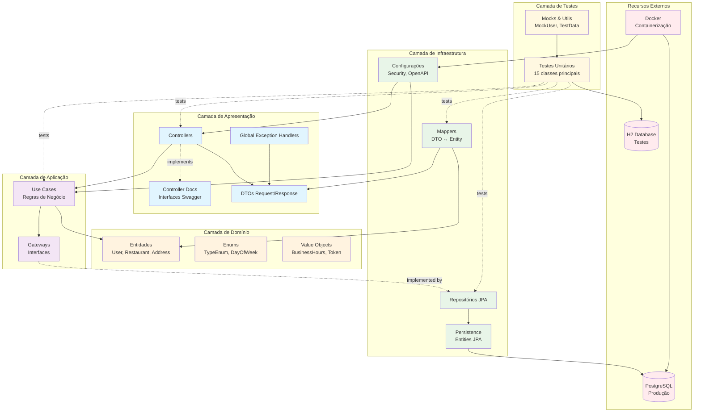

# Arquitetura do Sistema - Fortaleza de Sabor

## Visão Geral

O projeto Fortaleza de Sabor segue os princípios de **Clean Architecture** e **Domain-Driven Design (DDD)**, proporcionando uma separação clara de responsabilidades e alta testabilidade.

## Diagrama de Arquitetura



## Descrição das Camadas

### 🎯 **Camada de Apresentação**
**Responsabilidade**: Interface externa da aplicação
- **Controllers**: Endpoints REST (UserController, RestaurantController, AuthController)
- **Controller Docs**: Interfaces separadas com documentação Swagger
- **DTOs**: Objetos de transferência de dados (Request/Response)
- **Exception Handlers**: Tratamento global de exceções

### 🏗️ **Camada de Aplicação**
**Responsabilidade**: Orquestração das regras de negócio
- **Use Cases**: Implementação das regras de negócio específicas
  - `CreateUserUseCase`, `CreateRestaurantUseCase`
  - `UpdateUserUseCase`, `UpdateRestaurantUseCase`
  - `AuthUserUseCase`, `GetUserUseCase`, `DeleteUserUseCase`
- **Gateways**: Interfaces para acesso a dados (abstrações)

### 💎 **Camada de Domínio**
**Responsabilidade**: Núcleo da aplicação, regras de negócio puras
- **Entities**: Entidades principais (`User`, `Restaurant`, `Address`)
- **Value Objects**: Objetos de valor (`BusinessHours`, `Token`)
- **Enums**: Enumerações (`TypeEnum`, `DayOfWeek`)

### 🔧 **Camada de Infraestrutura**
**Responsabilidade**: Implementações técnicas e acesso a recursos externos
- **Repositories JPA**: Implementações concretas dos gateways
- **Mappers**: Conversão entre DTOs e entidades de domínio
- **Persistence Entities**: Entidades JPA para persistência
- **Configurações**: Security, OpenAPI, Database

### 💾 **Recursos Externos**
- **PostgreSQL**: Banco de dados principal para produção
- **H2 Database**: Banco em memória para testes
- **Docker**: Containerização da aplicação

### 🧪 **Camada de Testes**
**Responsabilidade**: Garantia da qualidade através de testes automatizados
- **Testes Unitários**: 15 classes principais com 35+ cenários
- **Test Utils**: Mocks, builders e utilitários para testes

## Benefícios da Arquitetura

### ✅ **Separação de Responsabilidades**
- Cada camada tem uma responsabilidade bem definida
- Baixo acoplamento entre camadas
- Alta coesão dentro de cada camada

### ✅ **Testabilidade**
- Inversão de dependências facilita mocking
- Testes unitários isolados para cada camada
- Cobertura completa de cenários

### ✅ **Manutenibilidade**
- Mudanças em uma camada não afetam outras
- Código organizado e fácil de navegar
- Documentação clara da estrutura

### ✅ **Flexibilidade**
- Fácil troca de implementações (ex: banco de dados)
- Extensibilidade para novas funcionalidades
- Adaptabilidade a diferentes ambientes

## Fluxo de Dados

### 📥 **Request Flow**
1. **Cliente** → Controller (Camada de Apresentação)
2. **Controller** → Use Case (Camada de Aplicação)
3. **Use Case** → Gateway Interface (Camada de Aplicação)
4. **Gateway** → Repository JPA (Camada de Infraestrutura)
5. **Repository** → Database (Recursos Externos)

### 📤 **Response Flow**
1. **Database** → Repository JPA
2. **Repository** → Use Case (através do Gateway)
3. **Use Case** → Controller
4. **Controller** → Cliente (via DTO)

### 🔄 **Transformações de Dados**
- **Request**: ClienteDTO → Mapper → DomainEntity
- **Processing**: DomainEntity → Use Case → Business Logic
- **Persistence**: DomainEntity → Mapper → JPAEntity → Database
- **Response**: Database → JPAEntity → Mapper → DomainEntity → DTO → Cliente

## Padrões Arquiteturais Utilizados

### 🏛️ **Clean Architecture**
- Dependências apontam para o centro (domínio)
- Camadas externas dependem das internas
- Domínio independente de frameworks

### 🎯 **Domain-Driven Design (DDD)**
- Entidades refletem o negócio de restaurantes
- Linguagem ubíqua entre código e negócio
- Bounded contexts bem definidos

### 🔀 **Dependency Inversion**
- Use Cases dependem de abstrações (Gateways)
- Implementações concretas na camada de infraestrutura
- Facilita testes e troca de implementações

### 📋 **Repository Pattern**
- Abstração para acesso a dados
- Centraliza lógica de persistência
- Facilita testes com mocks

### 🗺️ **Mapper Pattern**
- Separação entre DTOs e entidades de domínio
- Transformações centralizadas
- Facilita evolução independente das APIs

## Tecnologias por Camada

### **Apresentação**
- Spring MVC, SpringDoc OpenAPI, Bean Validation

### **Aplicação**
- Spring Core, Injeção de Dependência

### **Domínio**
- Java puro, sem dependências externas

### **Infraestrutura**
- Spring Data JPA, Hibernate, PostgreSQL, H2, Docker

### **Testes**
- JUnit 5, Mockito, Spring Test
    DTOs --> Mappers
    A --> UseCases
    ExceptionHandlers --> A
    UseCases --> Entities
    UseCases --> Gateways
    Gateways --> Repositories
    Repositories --> PostgreSQL
    Mappers --> Entities
    Mappers --> DTOs

    %% Estilização
    classDef presentation fill:#aef,stroke:#333,stroke-width:2px
    classDef domain fill:#fda,stroke:#333,stroke-width:2px
    classDef infrastructure fill:#dfa,stroke:#333,stroke-width:2px
    classDef database fill:#fad,stroke:#333,stroke-width:2px
    classDef documentation fill:#e6f3ff,stroke:#0066cc,stroke-width:2px

    class A,DTOs,ExceptionHandlers presentation
    class ControllerDocs documentation
    class UseCases,Entities domain
    class Gateways,Repositories,Mappers infrastructure
    class PostgreSQL database
```
