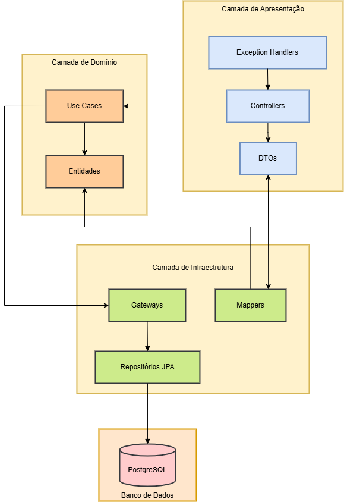

# Arquitetura do Sistema - Fortaleza de Sabor

## 🏗️ Visão Geral

O **Fortaleza de Sabor** implementa **Clean Architecture** com **Domain-Driven Design (DDD)**, garantindo:

- 📦 **Separação clara de responsabilidades** entre camadas
- 🔄 **Baixo acoplamento** e alta coesão
- 🧪 **Testabilidade** facilitada por inversão de dependências  
- 📈 **Escalabilidade** e manutenibilidade do código
- 🛡️ **Isolamento de regras de negócio** das tecnologias

## 📊 Diagrama de Arquitetura



```mermaid
graph TD
    %% Camadas da Aplicação
    subgraph API[🎯 Camada de Apresentação - Infrastructure]
        Controllers[Controllers REST<br/>• AuthController<br/>• UserController<br/>• RestaurantController<br/>• MenuItemsController<br/>• TypeController]
        DTOs[DTOs & Validation<br/>• Request/Response<br/>• Bean Validation<br/>• Global Exception Handler]
        Docs[Swagger Documentation<br/>• OpenAPI Interfaces<br/>• API Documentation]
    end

    subgraph APP[💼 Camada de Aplicação - Application]
        Ports[Ports (Interfaces)<br/>• Input Ports (Use Cases)<br/>• Output Ports (Repositories)]
        UseCases[Use Cases<br/>• AuthUseCase<br/>• UserUseCase<br/>• RestaurantUseCase<br/>• MenuItemsUseCase<br/>• TypeUseCase]
    end

    subgraph DOMAIN[🏛️ Camada de Domínio - Domain]
        Entities[Entidades de Negócio<br/>• User<br/>• Restaurant<br/>• Address<br/>• MenuItem<br/>• Token]
        ValueObjects[Value Objects<br/>• BusinessHours<br/>• TypeEnum<br/>• DayOfWeek]
    end

    subgraph INFRA[🔧 Camada de Infraestrutura - Infrastructure]
        Adapters[Adapters<br/>• Repository Adapters<br/>• External Services]
        Persistence[Persistence Layer<br/>• JPA Entities<br/>• JPA Repositories<br/>• Database Mappers]
        Config[Configurações<br/>• Security Config<br/>• OpenAPI Config<br/>• Database Config]
    end

    subgraph DB[🗄️ Banco de Dados]
        Prod[(PostgreSQL<br/>Produção)]
        Test[(H2 Database<br/>Testes)]
    end

    subgraph TESTING[🧪 Camada de Testes]
        Unit[46 Testes Unitários<br/>• Use Cases<br/>• Controllers<br/>• Mappers<br/>• DTOs]
        Integration[8 Testes Integração<br/>• REST-assured<br/>• H2 em memória<br/>• End-to-end]
    end

    %% Fluxo de Dependências (Clean Architecture)
    Controllers --> UseCases
    DTOs --> Controllers
    Docs --> Controllers
    UseCases --> Ports
    UseCases --> Entities
    Entities --> ValueObjects
    Adapters --> Ports
    Persistence --> Adapters
    Config --> INFRA
    
    %% Conexões com Banco
    Persistence --> Prod
    Integration --> Test
    
    %% Testes
    Unit --> APP
    Unit --> DOMAIN
    Unit --> API
    Integration --> API
```
    A --> UseCases
    UseCases --> Gateways
    UseCases --> Entities
    Gateways -.implemented by.-> RepositoriesJPA
    RepositoriesJPA --> Persistence
    Persistence --> PostgreSQL
    Mappers --> DTOs
    Mappers --> Entities
    ExceptionHandlers --> DTOs
    
    %% Relacionamentos de Teste
    UnitTests -.tests.-> A
    UnitTests -.tests.-> UseCases
    UnitTests -.tests.-> RepositoriesJPA
    UnitTests -.tests.-> Mappers
    UnitTests --> H2
    TestUtils --> UnitTests

    %% Configurações
    Config --> A
    Config --> UseCases
    Docker --> PostgreSQL
    Docker --> Config

    classDef apresentacao fill:#e1f5fe
    classDef aplicacao fill:#f3e5f5
    classDef dominio fill:#fff3e0
    
## 🎯 Princípios Aplicados

### Clean Architecture
- **Regra de Dependência**: Camadas internas não conhecem camadas externas
- **Inversão de Dependência**: Use Cases dependem de abstrações (Ports)
- **Separação de Responsabilidades**: Cada camada tem uma responsabilidade específica
- **Testabilidade**: Facilita criação de testes unitários e de integração

### Domain-Driven Design (DDD)
- **Linguagem Ubíqua**: Conceitos do domínio refletidos no código
- **Entidades de Domínio**: Representam conceitos do negócio
- **Value Objects**: Objetos imutáveis com lógica de domínio
- **Agregados**: Consistência transacional garantida

## 📦 Detalhamento das Camadas

### 🎯 **Camada de Apresentação** (`infrastructure.controller`)
**Responsabilidade**: Interface REST da aplicação

#### Controllers
- **AuthController** - Autenticação e autorização
- **UserController** - Gestão de usuários (CRUD)
- **RestaurantController** - Gestão de restaurantes
- **MenuItemsController** - Gestão de cardápio
- **TypeController** - Tipos de usuários

#### DTOs e Validação
- **Request DTOs**: Validação Bean Validation
- **Response DTOs**: Estrutura de resposta padronizada
- **Global Exception Handler**: Tratamento centralizado de erros

#### Documentação
- **Swagger Interfaces**: Documentação OpenAPI separada dos controllers
- **OpenAPI Configuration**: Configuração centralizada da documentação

### 💼 **Camada de Aplicação** (`application`)
**Responsabilidade**: Orquestração das regras de negócio

#### Ports (Interfaces)
- **Input Ports**: Interfaces dos Use Cases
- **Output Ports**: Interfaces dos Repositórios

#### Use Cases Implementados
```java
// Autenticação
AuthUseCase - validateLogin(), updatePassword()

// Usuários
UserUseCase - save(), getAll(), getById(), update(), delete()

// Restaurantes
RestaurantUseCase - create(), update(), getAll(), getById(), delete(), updateOwner()

// Itens do Cardápio
MenuItemsUseCase - save(), getAll(), getById(), update(), delete()

// Tipos de Usuário
TypeUseCase - create(), getAll(), getById(), update(), delete()
```


### 🏛️ **Camada de Domínio** (`domain.model`)
**Responsabilidade**: Núcleo da aplicação com entidades, value objects e regras de negócio puras, sem dependências externas.

#### Entidades Principais
```java
// Usuário
User {
  Long id;
  String name;
  String email;
  String login;
  String password;
  List<Address> addresses;
  TypeUser typeUser;
}

// Restaurant
Restaurant {
  Long id;
  String name;
  String kitchenType;
  String email;
  String ownerName;
  List<Address> addresses;
  List<BusinessHours> businessHours;
}

// Item de Cardápio
MenuItem {
  Long id;
  String name;
  String description;
  BigDecimal price;
  Long restaurantId;
}

// Type de Usuário
TypeUser {
  Long id;
  String nameType;
}

// Endereço
Address {
  String street;
  String neighborhood;
  String complement;
  Integer number;
  String state;
  String city;
  String zipCode;
}
```

#### Value Objects
```java
// Horário de Funcionamento
BusinessHours {
  DayOfWeek dayOfWeek;
  LocalTime openingTime;
  LocalTime closingTime;
  String observations;
}

// Token JWT
Token {
  String accessToken;
  Long expiresIn;
}
```


### 🔧 **Camada de Infraestrutura** (`infrastructure`)
**Responsabilidade**: Implementações técnicas, integração com frameworks, persistência e configurações externas.

#### Adapters e Repositórios
- **UserRepositoryJpa**: Implementa UserRepositoryPort
- **RestaurantRepositoryJpa**: Implementa RestaurantRepositoryPort
- **MenuRepositoryJpa**: Implementa MenuItemsRepositoryPort
- **TypeUserRepositoryJpa**: Implementa TypeRepositoryPort
- **AuthRepositoryJpa**: Implementa AuthRepositoryPort

#### Mappers e Conversão de Dados
```java
// Conversores entre camadas
UserMapper: UserRequestDto ↔ User ↔ UserEntity ↔ UserResponseDto
RestaurantMapper: RestaurantRequestDto ↔ Restaurant ↔ RestaurantEntity ↔ RestaurantResponseDto
MenuMapper: MenuItemRequestDto ↔ MenuItem ↔ MenuItemEntity ↔ MenuItemResponseDto
TypeUserMapper: TypeUserRequestDto ↔ TypeUser ↔ TypeUserEntity ↔ TypeUserResponseDto
AddressMapper: AddressRequestDto ↔ Address ↔ AddressEntity ↔ AddressResponseDto
// Conversão bidirecional entre DTOs, entidades de domínio e entidades JPA
```

#### Entidades JPA (Persistence)
```java
UserEntity, RestaurantEntity, AddressEntity, MenuItemEntity, TypeUserEntity
```

#### Configurações e Integrações
- **SecurityConfig**: Configuração de autenticação JWT, autorização, CORS
- **OpenAPIConfig**: Configuração centralizada da documentação Swagger
- **DatabaseConfig**: Configuração de datasources PostgreSQL/H2
- **ExceptionHandler**: Tratamento global de exceções

#### Outras Responsabilidades
- Integração com frameworks Spring Boot, Spring Data JPA, Bean Validation
- Implementação de serviços externos e utilitários


## 🧪 **Estratégia de Testes**

O projeto adota uma abordagem de testes automatizados em múltiplos níveis para garantir robustez, qualidade e segurança:

### Testes Unitários
- Cobrem regras de negócio dos Use Cases, validação de DTOs, conversão de mapeamentos e lógica isolada.
- Utilizam JUnit 5 e Mockito para simulação de dependências.
- Padrão AAA (Arrange, Act, Assert) aplicado em todos os testes.

### Testes de Integração
- Validam fluxos completos dos endpoints REST, integração com banco H2 em memória e autenticação JWT.
- Utilizam REST-assured, SpringBootTest e contexto real da aplicação.
- Cobrem cenários de sucesso, erro, autenticação e edge cases.

### Cobertura e Relatórios
- 54 testes automatizados (46 unitários + 8 integração)
- Cobertura total dos principais fluxos de negócio, controllers e mapeamentos
- Relatórios gerados em `/target/surefire-reports/`

### Boas Práticas
- Nomenclatura unificada: `shouldXWhenY` em todos os testes
- Testes independentes e reprodutíveis
- Validação de Bean Validation, conversão de dados e tratamento de exceções

Consulte detalhes completos de cenários, comandos e exemplos em [`DOCUMENTACAO_COMPLETA_TESTES.md`](DOCUMENTACAO_COMPLETA_TESTES.md).

## ✅ **Benefícios da Arquitetura**

### 🎯 **Separação de Responsabilidades**
- Cada camada tem uma responsabilidade bem definida
- Baixo acoplamento entre camadas
- Alta coesão dentro de cada camada
- Facilita compreensão e manutenção do código

### 🧪 **Testabilidade Avançada**
- **54 testes** (46 unitários + 8 integração) com 100% sucesso
- Mudanças em uma camada não impactam outras
- Código organizado e fácil de navegar
- Documentação clara da estrutura
- Padrões consistentes aplicados

### 🚀 **Escalabilidade e Flexibilidade**
- Fácil adição de novas funcionalidades
- Troca simples de implementações (ex: banco de dados)
- Adaptabilidade a diferentes ambientes
- Suporte a diferentes interfaces (REST, GraphQL, etc.)

## 🔄 **Fluxo de Dados**

### 📥 **Request Flow (Entrada)**
```
1. Cliente HTTP → Controller (REST endpoint)
2. Controller → DTO Request (validação Bean Validation)  
3. Controller → Use Case (regras de negócio)
4. Use Case → Repository Port (interface)
5. Repository Adapter → Database (PostgreSQL/H2)
```

### 📤 **Response Flow (Saída)**
```
1. Database → Repository Adapter
2. Repository Adapter → Use Case  
3. Use Case → Controller
4. Controller → DTO Response (serialização)
5. Controller → Cliente HTTP (JSON)
```

### 🔄 **Exemplo Prático: Criar Usuário**
```java
// 1. Controller recebe requisição
@PostMapping("/users")
public ResponseEntity<UserResponseDto> createUser(@Valid @RequestBody UserRequestDto request) {

// 2. Controller chama Use Case
User user = userMapper.toUserDomain(request);
User savedUser = userUseCasePort.save(user);

// 3. Use Case executa regras de negócio
public User save(User user) {
    // Validações de negócio
    // Criptografia de password
    return userRepositoryPort.save(user);
}

// 4. Repository persiste no banco
UserEntity entity = userMapper.toUserEntity(user);
UserEntity saved = userJpaRepository.save(entity);

// 5. Resposta retorna pela stack
return ResponseEntity.created().body(userResponseDto);
```

## 🏗️ **Estrutura de Pastas**

```
src/main/java/com/br/fiap/fortaleza/sabor/
├── 📁 application/              # Camada de Aplicação
│   ├── 📁 ports/
│   │   ├── 📁 in/              # Input Ports (Use Cases)
│   │   └── 📁 out/             # Output Ports (Repositories)
│   └── 📁 usecase/             # Implementação dos Use Cases
├── 📁 domain/                  # Camada de Domínio
│   └── 📁 model/               # Entidades e Value Objects
└── 📁 infrastructure/          # Camada de Infraestrutura
    ├── 📁 adapter/             # Adapters (Repository implementations)
    ├── 📁 config/              # Configurações Spring
    ├── 📁 controller/          # Controllers REST
    │   ├── docs/             # Interfaces Swagger
    │   └── 📁 dto/            # DTOs Request/Response
    ├── 📁 mapper/              # Conversores entre camadas
    ├── 📁 persistence/         # Entidades JPA
    │   ├── entity/            # JPA Entities
    │   └── repository/        # JPA Repositories
```

## 📊 **Métricas de Qualidade**

### Cobertura de Testes
- ✅ **Use Cases**: 11/11 classes (100%)
- ✅ **Controllers**: 5/5 classes (100%)
- ✅ **Mappers**: 4/4 classes (100%)
- ✅ **DTOs**: 9/9 classes principais (100%)
- ✅ **Repositories**: 2/2 classes customizadas (100%)

### Padrões Arquiteturais
- ✅ **Clean Architecture**: Implementação completa
- ✅ **DDD**: Entidades e Value Objects bem definidos
- ✅ **SOLID**: Princípios aplicados consistentemente
- ✅ **Ports & Adapters**: Inversão de dependências

### Qualidade do Código
- ✅ **Nomenclatura**: Padrões consistentes
- ✅ **Separação**: Responsabilidades bem definidas
- ✅ **Testabilidade**: 100% das classes testáveis
- ✅ **Documentação**: Swagger completo + documentação técnica

---

**Esta arquitetura garante um sistema robusto, testável e mantível, seguindo as melhores práticas de desenvolvimento de software empresarial.** 🏗️✨
3. **Use Case** → Gateway Interface (Camada de Aplicação)
4. **Gateway** → Repository JPA (Camada de Infraestrutura)
5. **Repository** → Database (Recursos Externos)

### 📤 **Response Flow**
1. **Database** → Repository JPA
2. **Repository** → Use Case (através do Gateway)
3. **Use Case** → Controller
4. **Controller** → Cliente (via DTO)

### 🔄 **Transformações de Dados**
- **Request**: ClienteDTO → Mapper → DomainEntity
- **Processing**: DomainEntity → Use Case → Business Logic
- **Persistence**: DomainEntity → Mapper → JPAEntity → Database
- **Response**: Database → JPAEntity → Mapper → DomainEntity → DTO → Cliente

## Padrões Arquiteturais Utilizados

### 🏛️ **Clean Architecture**
- Dependências apontam para o centro (domínio)
- Camadas externas dependem das internas
- Domínio independente de frameworks

### 🎯 **Domain-Driven Design (DDD)**
- Entidades refletem o negócio de restaurantes
- Linguagem ubíqua entre código e negócio
- Bounded contexts bem definidos

### 🔀 **Dependency Inversion**
- Use Cases dependem de abstrações (Gateways)
- Implementações concretas na camada de infraestrutura
- Facilita testes e troca de implementações

### 📋 **Repository Pattern**
- Abstração para acesso a dados
- Centraliza lógica de persistência
- Facilita testes com mocks

### 🗺️ **Mapper Pattern**
- Separação entre DTOs e entidades de domínio
- Transformações centralizadas
- Facilita evolução independente das APIs

## Tecnologias por Camada

### **Apresentação**
- Spring MVC, SpringDoc OpenAPI, Bean Validation

### **Aplicação**
- Spring Core, Injeção de Dependência

### **Domínio**
- Java puro, sem dependências externas

### **Infraestrutura**
- Spring Data JPA, Hibernate, PostgreSQL, H2, Docker

### **Testes**
- JUnit 5, Mockito, Spring Test
    DTOs --> Mappers
    A --> UseCases
    ExceptionHandlers --> A
    UseCases --> Entities
    UseCases --> Gateways
    Gateways --> Repositories
    Repositories --> PostgreSQL
    Mappers --> Entities
    Mappers --> DTOs

    %% Estilização
    classDef presentation fill:#aef,stroke:#333,stroke-width:2px
    classDef domain fill:#fda,stroke:#333,stroke-width:2px
    classDef infrastructure fill:#dfa,stroke:#333,stroke-width:2px
    classDef database fill:#fad,stroke:#333,stroke-width:2px
    classDef documentation fill:#e6f3ff,stroke:#0066cc,stroke-width:2px

    class A,DTOs,ExceptionHandlers presentation
    class ControllerDocs documentation
    class UseCases,Entities domain
    class Gateways,Repositories,Mappers infrastructure
    class PostgreSQL database

---

```
